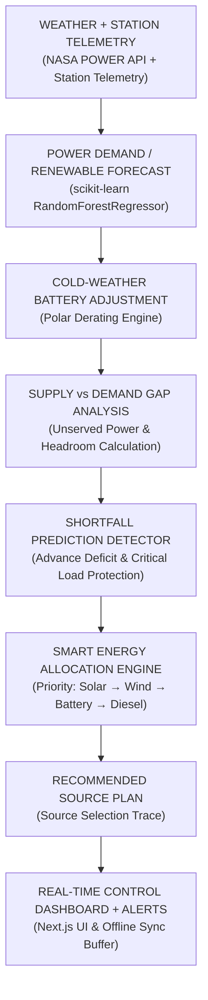

# PRAKASH: AI-Driven Smart Energy Management System for Polar Research Stations

**SIH Problem Statement:** SIH26061  
**Team:** AntarctiX  
**Target Stations:** Bharati (-69.408°S, 76.195°E) and Maitri (-70.766°S, 11.733°E), East Antarctica  

---

## 🏔️ Project Overview

**PRAKASH** is an operational, full-stack Smart Energy Management MVP designed specifically for Indian Antarctic Research Stations. The system optimizes multi-source energy allocation, mitigates avoidable diesel burn, protects critical life-support thermal loads, and predicts power deficits up to 6 hours in advance using Machine Learning and Antarctic rule-based thermodynamic models.

---

## 🔄 Complete SIH Decision Flow



---

## ⚡ Core Engine Features

### 1. Priority Allocation Engine
Strictest priority allocation sequence to maximize renewable utilization and minimize fuel consumption:
1. **Solar PV Generation** (Priority 1)
2. **Wind Turbine Generation** (Priority 2)
3. **Battery Storage Discharge** (Priority 3)
4. **Diesel Generator Dispatch** (Priority 4 — Last Resort)

**Critical Load Protection:** Guarantees power to critical life-support and heating facilities (65-70% threshold). If available supply drops below requirement, non-critical research facilities are shed gracefully.

### 2. Cold-Weather Battery Derating Model
Rule-based Antarctic thermal derating model:
- $\ge 0^\circ\text{C}$: 0% Derating
- $-10^\circ\text{C}$: 15% Capacity Derating
- $-20^\circ\text{C}$: 35% Capacity Derating
- $< -20^\circ\text{C}$: Conservative polar linear interpolation ($35\% + 1.5\% / ^\circ\text{C}$)

### 3. ML Forecast Engine
Uses `RandomForestRegressor` trained on historical Antarctic diurnal and thermal cycles to forecast next 6-hour step-by-step:
- Predicted Demand (kW)
- Solar Irradiance & Generation (kW)
- Wind Speed & Generation (kW)
- Total Renewable Supply & Deficit Gap (kW)

### 4. Generator Anomaly Detection Engine
Uses scikit-learn `IsolationForest` to analyze simulated generator telemetry (power, engine temperature, load factor, runtime, fuel rate). Degraded units are flagged, downgrading effective output capacity (e.g. 250 kW rated $\rightarrow$ 100 kW effective).

### 5. Offline-First Architecture
When satellite link or internet connection drops:
- System transitions seamlessly to **OFFLINE — LOCAL EDGE MODE**
- Leverages local SQLite event buffer (`prakash_offline.db`) and cached weather profile
- Queues offline actions and telemetry logs with a **SYNC NOW** button upon network restoration

---

## 🏷️ Data Strategy & Transparency Disclosure

- **NASA POWER API (Public Weather Data):** Live public solar radiation, 10m wind speed, and 2m ambient air temperature fetched directly from NASA POWER REST API. Explicitly labeled `NASA/PUBLIC WEATHER DATA`.
- **Simulated Station Telemetry:** Station-level NCPOR power data is currently unavailable per official SIH guidance. Station load, battery SOC, fuel reserve, generator output, and fuel burn are generated via validated synthetic physical models. Explicitly labeled `SIMULATED STATION TELEMETRY`.

---

## 🛠️ Technology Stack

- **Frontend:** Next.js 14 (React 18), Tailwind CSS, Recharts, Lucide React icons
- **Backend:** Python 3.14, FastAPI, Uvicorn, SQLite3, HTTPX
- **ML / AI:** scikit-learn (`RandomForestRegressor`, `IsolationForest`), NumPy, Pandas

---

## 🚀 Quickstart & Setup Instructions

### 1. Backend Server Setup
```bash
cd backend
python -m pip install -r requirements.txt
python main.py
```
The FastAPI backend server will run at `http://127.0.0.1:8000`.

### 2. Frontend Application Setup
```bash
cd frontend
npm install
npm run dev
```
Open `http://localhost:3000` in your web browser.

### 3. Running Automated Acceptance Tests
To verify all 8 SIH scenario acceptance tests:
```bash
cd backend
python test_all_scenarios.py
```

---

## 🎬 60-90 Second SIH Demo Presentation Mode

Click **LIVE DEMO MODE (60s)** in the dashboard header to launch the automated step-by-step presentation for SIH judges:
1. **Normal Operation Baseline** (100% renewables, zero diesel)
2. **High Research Load Spike** (Battery discharge cushions +60% load spike)
3. **Extreme Polar Cold (-38°C)** (62% battery derating active)
4. **AI Shortfall Prediction Alert** (Advance warning for low wind window)
5. **Generator Fault & Critical Load Shedding** (IsolationForest flags degradation, sheds non-critical load)
6. **Offline-First Resilience & Sync** (SQLite local queuing and sync)
7. **Multi-Station Switch** (Maitri Station -70.766°S)

---

## 📄 API Reference Endpoints

| Method | Endpoint | Description |
|---|---|---|
| `GET` | `/api/stations` | List supported polar stations (Bharati & Maitri) |
| `GET` | `/api/current-state` | Fetch current station telemetry, forecast, allocation & shortfall risk |
| `GET` | `/api/forecast` | Retrieve 6-hour ML Random Forest forecast |
| `POST` | `/api/scenario` | Trigger What-If scenario recomputation (BEFORE vs AFTER) |
| `POST` | `/api/offline/sync` | Flush and sync offline queued events |
| `GET` | `/api/kpis` | Calculate live renewable share & fuel saved metrics |
